# Уомпьютер РАДУГА
Поэтапный процесс воссоздания схемы

### 28.03.2019 Плата

Мне привезли не рабочую плату, на плате отсутсвует 13 микросхем. От которых остались только позолоченные выводы. Вероятно миросхемы кто-то сдал в драгмет. На плате имеется доработка, одна микросхема допаяна сверху. Отсутсвуют дискретные компоненты, скорее всего конденсаторы или диды. 

*Мои действия* 

Первым делом были выпаяны остатки выводов. Судя по всему часть "золоых" микросхем была К533 или К1533 серии. Также очевидно что часть из них это адресный мультиплексор, а это упрощает срисовывание схемы. Хуже то, что при выкушивании микросхем были повреждены трассы, а также выкушены часть резисторов (видимо мешали обогащаться).

Лицевая сторона платы сильно подверглась оксидизации, видимо из за агресивного флюса который небыл смыт. С обратной стороны использовалась канифоль, но в неприличных количествах, и она не была смыта. 

Ушло грам двести изопропинола и столько же растворителя 646 чтобы смыть все это. Но некоторые трассы под флюсом частично разрушились.

Теперь стало ясно что это самая первая плата Радуги. Я помню, что когда пришли первые платы с завода они были немного бракованые. Переходные отверстия слишком малы, текстолит не слишком качественный, медь на нем держалась плохо, а трассы были слишком тонкие включая трассы питания. Было решено платы доработать, а из этих собрать первый прототип для проверки.

## 29.03.2019 ПЗУ

Две из трех стоящих на плате ПЗУ были в панельках, но оказались муляжем. Не смотря на то что одна из них 2764, на самом деле по трассам все три места места только под 2716 (573РФ5). 

Третье, запаяное ПЗУ имеет маркер карандашом "ЗН". Вероятно "знакогенератор", это и логично. Выпаять микросхему не удалось, выводы слишком плотно сидят в посадочных отверстиях. Зазоры малы, можно сказать их вообще нет. 

Отрезав питание от микросхемы, подключив программатор к соседней панельке многократно считываю содержимое, данные постоянны и каждый раз совпадают. 

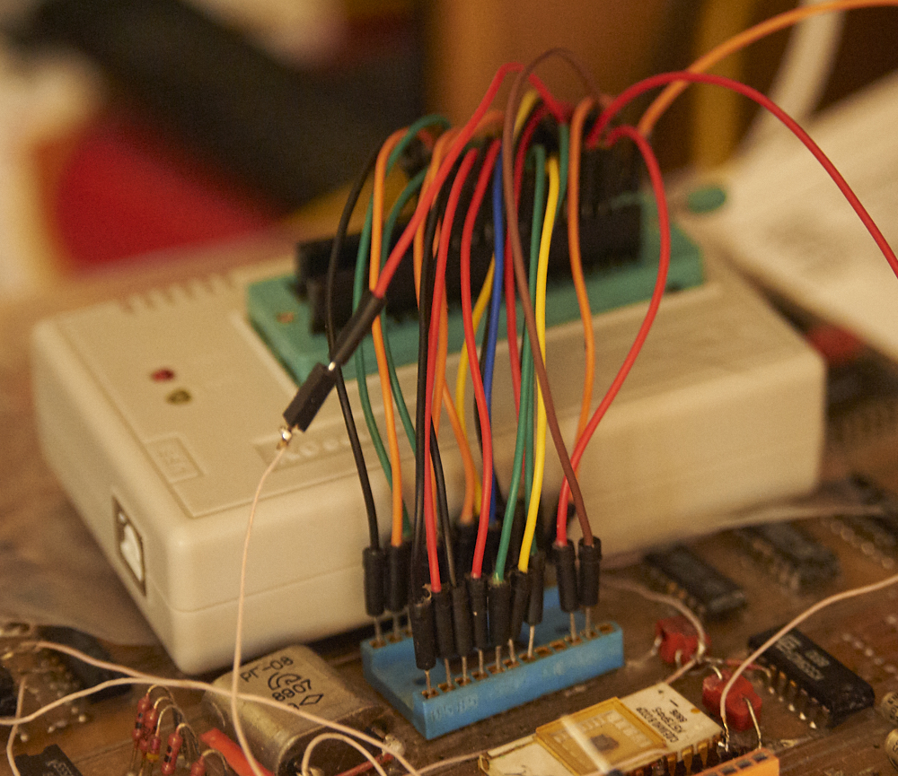

Однако сами данные "мусор", возможно плата долго лежала на солнце, к примеру на подоконнике. Отсюда и усиленная оксидизация лицевой стороны.

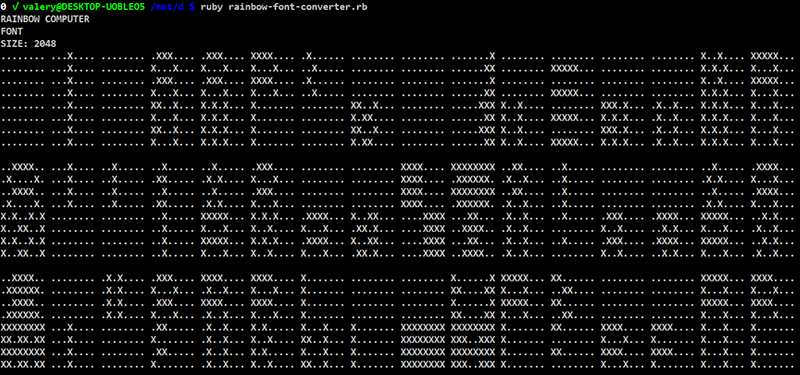

### 30.03.2019 Клавиатура (Дешифратор)

Для сканирования клавиатуры установлен 1555ИД3. Выходы которого через 13 диодов подключены к разьему. 

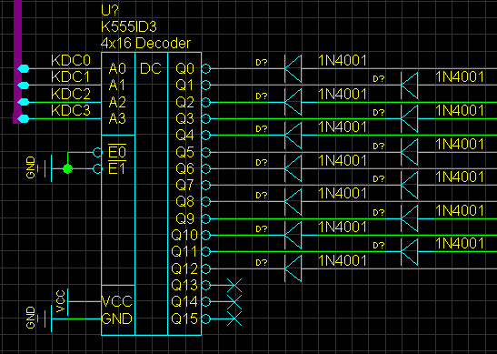

Входы дешифратора подключены к паралеьному порту (1), а их в системе используется два.

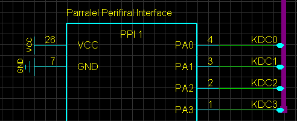

### 30.03.2019 ОЗУ

На плате установлены 16 микросхем 565РУ5 и 4 микросжемы 589АП16. Восемь из 16 микросхем также подключены ка 589ИР12, выкоды которой подключены к 155ИР1. Другие восемь микросхем имеют две 589ИР12 и также две 155ИР1. Схема очень похлжа на "Специалит". Но в отличии от "Специалист" входы и выходы данных у микросхем памяти замкнуты.

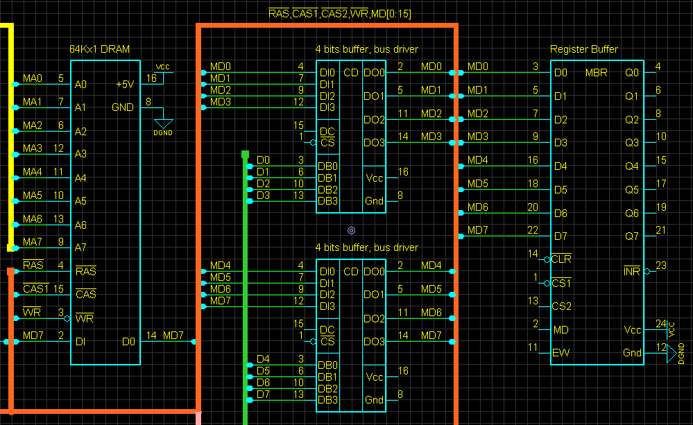

Сигналы ~RAS и ~WE у всех микосхем обьеденены, а вот ~CAS раздельные у каждого байта.

Дополнительная 589ИР12 имеет замкнутые входы и выходы, видимо это "копир" мы его еще называли "пересылочный регистр".

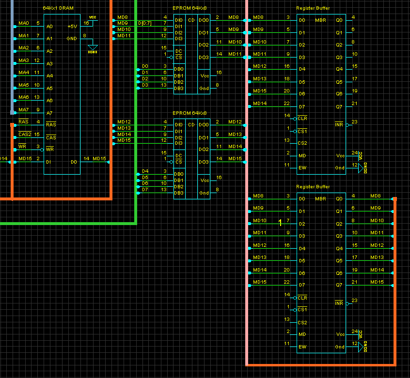

Вывод 6 у всех четырех сдвиговых регистров обьеденен, а вывод 9 у микросхем отвечающих за цвет соединен с землей. Вывод 8 у них подключен к 8,9 выводу регистров отвечающих за яркость точки.

*Звук*

Таймер ВИ53 генерирует три частоты, каждая имеет логарифмический ЦАП на 8 шагов. 

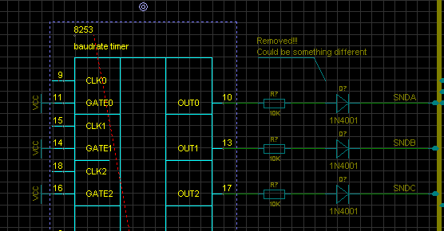

Микросхемы ЦАП отсуствуют но полагаю сояли 533ИД10. У каждого дешифратора используется только три входы и 8 выходов. Резисторы схранились и на них видны номиналы.

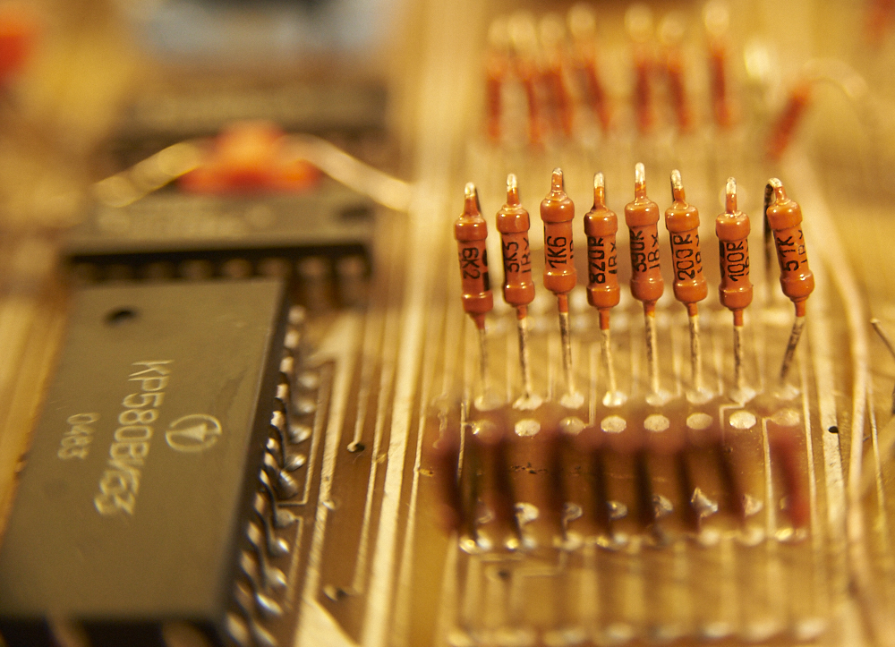

Получается примерно такая схема.

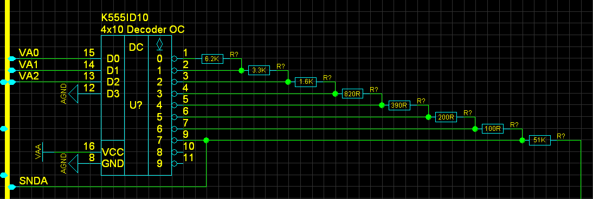

Я помню что для мимнимизации были выбраны именно 8 шагов логарифмической шкалы. Шкалу нельзя назвать логарифмической, точнее она приближенная к логарифму. Номиналы резистора отличались примерно в двое, но они подключались последовательно в цепь. Отступы от удвоенных значений были подобраны так чтобы получался более менее приемлемый результат при очень скромной схемотехнике.

Всего четыре канала ABCD, и четтвертый используется для шума.

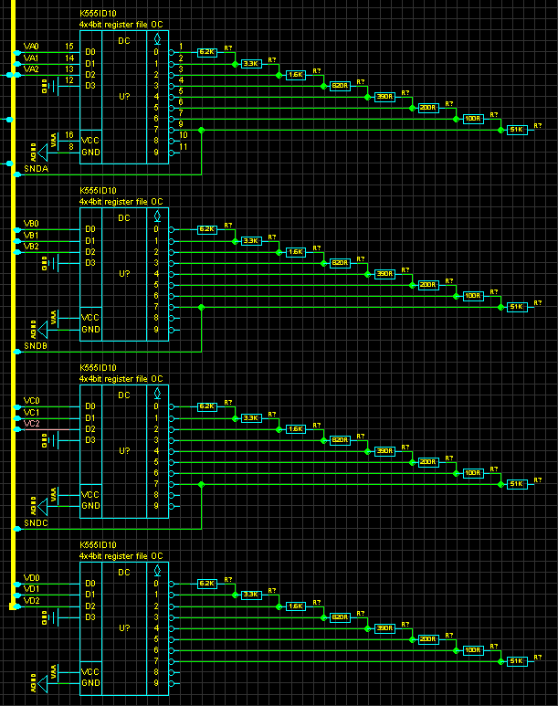

Входы дешифраторв ЦАП подключены к парралельным програмируемым портам (1) и (2)

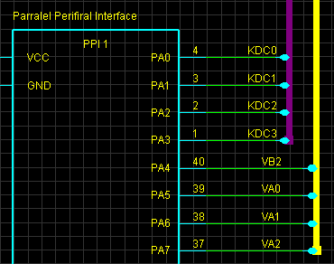

